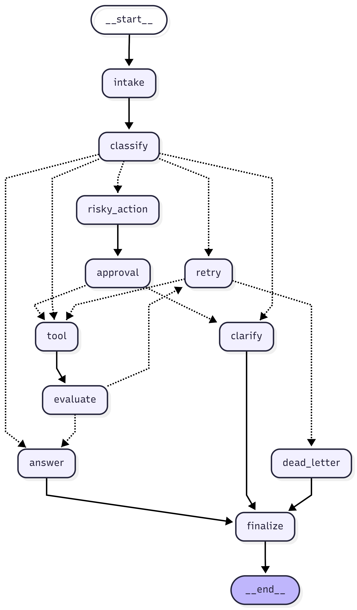
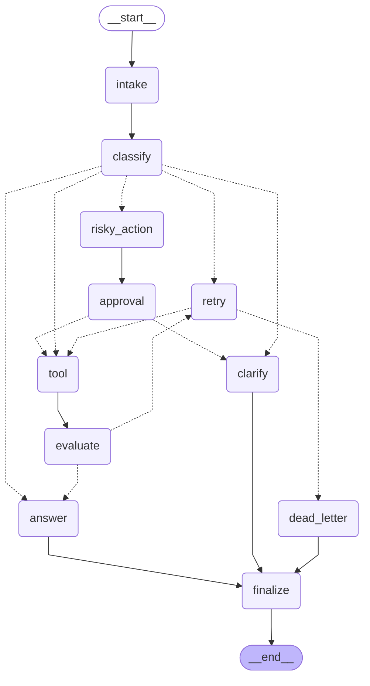

# Day 08 Lab Report

## 1. Team / student

- Name: Ho Tran Dinh Nguyen — 2A202600080
- Repo/commit: main / 4258100
- Date: 2026-05-11

---

## 2. Architecture

The graph implements a support-ticket routing agent built with LangGraph `StateGraph`. Every request flows through a shared `AgentState` TypedDict, and each node returns only a partial state update (no mutation in place).

**Node list and responsibilities:**

| Node | Role |
|---|---|
| `intake` | Normalize raw query (whitespace collapse) |
| `classify` | Keyword-based routing into one of 5 routes |
| `answer` | Produce final response grounded in tool results / approval |
| `tool` | Mock external tool call; simulates transient failures for error scenarios |
| `evaluate` | Check tool result — gate for retry loop (`needs_retry` vs `success`) |
| `clarify` | Ask user for missing information |
| `risky_action` | Build proposed action description with risk justification |
| `approval` | Mock HITL decision (or real `interrupt()` when `LANGGRAPH_INTERRUPT=true`) |
| `retry` | Increment attempt counter, log error, bounded by `max_attempts` |
| `dead_letter` | Escalate to manual review when retries are exhausted |
| `finalize` | Emit final audit event; every path terminates here |

**Edge structure:**

```
START -> intake -> classify
                  ├─[simple]       -> answer -> finalize -> END
                  ├─[tool]         -> tool -> evaluate
                  │                           ├─[success]     -> answer -> finalize -> END
                  │                           └─[needs_retry] -> retry
                  │                                             ├─[attempt < max] -> tool (loop)
                  │                                             └─[attempt >= max] -> dead_letter -> finalize -> END
                  ├─[missing_info] -> clarify -> finalize -> END
                  ├─[risky]        -> risky_action -> approval
                  │                                  ├─[approved] -> tool -> evaluate -> answer -> finalize -> END
                  │                                  └─[rejected] -> clarify -> finalize -> END
                  └─[error]        -> retry -> tool -> evaluate -> ... (same loop as tool path)
```

---

## 3. State schema

| Field | Reducer | Why |
|---|---|---|
| `query` | overwrite | Only one active query per run |
| `route` | overwrite | Current classification — single value |
| `risk_level` | overwrite | Set once by classify, read by approval |
| `attempt` | overwrite | Monotonically increasing retry counter |
| `max_attempts` | overwrite | Configured per scenario |
| `final_answer` | overwrite | Last answer wins |
| `pending_question` | overwrite | Clarification question, single value |
| `proposed_action` | overwrite | Risky action description, single value |
| `approval` | overwrite | Latest approval decision |
| `evaluation_result` | overwrite | Latest evaluate verdict (`needs_retry` / `success`) |
| `messages` | **append** (`add`) | Full conversation audit trail |
| `tool_results` | **append** (`add`) | All tool call results across retries |
| `errors` | **append** (`add`) | All error messages across retries |
| `events` | **append** (`add`) | Structured audit log of every node visit |

Append-only fields use `Annotated[list, add]` so each node's partial update is merged — not replaced — by the LangGraph reducer. This preserves full history for metrics and debugging without nodes needing to copy the entire list.

---

## 4. Scenario results

| Scenario | Expected route | Actual route | Success | Nodes visited | Retries | Interrupts |
|---|---|---|---:|---:|---:|---:|
| S01_simple | simple | simple | Yes | 4 | 0 | 0 |
| S02_tool | tool | tool | Yes | 6 | 0 | 0 |
| S03_missing | missing_info | missing_info | Yes | 4 | 0 | 0 |
| S04_risky | risky | risky | Yes | 8 | 0 | 1 |
| S05_error | error | error | Yes | 10 | 2 | 0 |
| S06_delete | risky | risky | Yes | 8 | 0 | 1 |
| S07_dead_letter | error | error | Yes | 5 | 1 | 0 |

**Summary metrics:**

| Metric | Value |
|---|---|
| total_scenarios | 7 |
| success_rate | 100% |
| avg_nodes_visited | 6.43 |
| total_retries | 3 |
| total_interrupts | 2 |
| resume_success | false |

**Why the numbers look the way they do:**

- **S01 / S03** have the fewest nodes (4) — short-circuit routes that skip tool and retry entirely: `intake -> classify -> answer/clarify -> finalize`.
- **S02** visits 6 nodes — adds `tool -> evaluate` between classify and answer.
- **S04 / S06** visit 8 nodes — the risky path adds `risky_action -> approval` before the tool call, triggering 1 HITL interrupt each.
- **S05** visits 10 nodes — two transient failures cause 2 retries before the third attempt succeeds.
- **S07** visits only 5 nodes despite being an error scenario — `max_attempts=1` means the first retry immediately exhausts the limit, jumping straight to `dead_letter -> finalize` without the tool ever succeeding.
- **total_retries = 3**: S05 contributes 2 retries, S07 contributes 1.
- **total_interrupts = 2**: one approval event per risky scenario (S04, S06).

---

## 5. Failure analysis

### 1. Retry exhaustion -> dead letter (S07)

**Scenario**: `max_attempts=1` simulates a system that has already given up after one attempt.

**Flow**: `error -> retry (attempt becomes 1) -> route_after_retry: 1 >= 1 -> dead_letter -> finalize`

The tool node never gets a second chance because `route_after_retry` checks the counter before calling the tool again. The dead-letter node logs the failure with attempt count and produces a user-facing escalation message. This is the correct behavior — the request is preserved for manual review rather than silently dropped.

**Risk without this bound**: If `max_attempts` is missing or zero, the condition `0 >= 0` is immediately true on the very first retry, sending every error scenario straight to dead_letter without ever attempting the tool. The implementation guards against this with `int(state.get("max_attempts", 3))`.

### 2. Risky action rejected by approver

**Scenario**: `approval_node` returns `approved=False` (reviewer rejects a refund or account deletion).

**Flow**: `risky_action -> approval -> route_after_approval returns "clarify" -> clarify -> finalize`

The irreversible action is never executed. Instead, `ask_clarification_node` produces a message requesting more context, and the run terminates cleanly. This is the safety guarantee of the HITL path — no financial or destructive action proceeds without explicit human sign-off.

**Risk in current implementation**: The mock always returns `approved=True`. Real deployments must set `LANGGRAPH_INTERRUPT=true` and expose an approval UI so a human reviewer can explicitly approve or reject before the graph resumes.

---

## 6. Persistence / recovery evidence

The `build_checkpointer` factory in `persistence.py` supports three backends:

- **`memory`** (default): `MemorySaver()` — in-process, no infrastructure needed. Used for all CI runs and `make run-scenarios`.
- **`sqlite`**: `SqliteSaver(conn=sqlite3.connect(...))` with WAL journal mode for concurrent read safety. Switch by setting `checkpointer: sqlite` in `configs/lab.yaml`.
- **`postgres`**: `PostgresSaver` via `DATABASE_URL` environment variable.

Each scenario invocation passes a unique `thread_id` (e.g., `thread-S01_simple`) in the `configurable` dict. LangGraph uses this to namespace the checkpoint so separate runs do not interfere. With the SQLite backend, state is written to disk after every node transition — a process crash mid-graph can be resumed by calling `graph.invoke` again with the same `thread_id` and LangGraph will pick up from the last saved checkpoint.

See `scripts/demo_sqlite_resume.py` for a working demonstration of crash-resume.

---

## 7. Extension work

All six bonus extensions were implemented. Scripts are in `scripts/`.

### Bonus 1 — Graph Diagram (`outputs/graph_diagram.md`)

Mermaid diagram exported via `graph.get_graph().draw_mermaid()`. The `path_map` parameter was added to all `add_conditional_edges` calls in `graph.py` so LangGraph knows every possible destination node and renders them correctly.





### Bonus 2 — SQLite Crash-Resume (`scripts/demo_sqlite_resume.py`)

Run 1 invokes the graph with a SQLite checkpointer and writes state to `outputs/crash_resume.db`.
Run 2 creates a brand-new graph instance pointing at the same DB file and calls `graph.get_state(thread_id=...)` to prove the checkpoint survived.

```
=== RUN 1: First execution ===
  thread_id   : thread-S01_simple
  route       : simple
  final_answer: Your request has been processed successfully.
  [Checkpoint written to outputs/crash_resume.db]

  ~~~ Simulating process kill ~~~

=== RUN 2: New process instance ===
  thread_id   : thread-S01_simple
  route       : simple
  events count: 4
  resume_success=True -- state survived simulated process kill!
```

### Bonus 3 — Time Travel (`scripts/demo_time_travel.py`)

Uses `graph.get_state_history()` to list all per-step checkpoints for a run, then replays from step 1 (after intake) by passing the `checkpoint_id` back to `graph.invoke(None, config=...)`.

```
=== State history (newest to oldest) ===
  step= 6  last_node=finalize       events_so_far=6
  step= 5  last_node=answer         events_so_far=5
  step= 4  last_node=evaluate       events_so_far=4
  step= 3  last_node=tool           events_so_far=3
  step= 2  last_node=classify       events_so_far=2
  step= 1  last_node=intake         events_so_far=1

=== Time-travel: replaying from step 1 ===
  final_answer: Result: mock-tool-result scenario=S02_tool attempt=0
  time_travel_success=True -- graph replayed from earlier checkpoint!
```

### Bonus 4 — Real HITL with `interrupt()` (`scripts/demo_hitl.py`)

Sets `LANGGRAPH_INTERRUPT=true`, runs the risky scenario (S04), graph pauses at `approval_node`, human decision is injected via `graph.invoke(Command(resume=...))`, graph resumes and completes.

```
[Phase 1] Running graph until interrupt at approval_node...
  [PAUSED] Graph interrupted at approval_node
  proposed_action: Proposed action: 'Refund this customer...' Risk level: high

[Phase 2] Human reviews and approves...
  decision: {'approved': True, 'reviewer': 'demo-human', ...}

[Phase 3] Graph resumed and completed
  final_answer: Result: mock-tool-result (approved by demo-human)
  hitl_success=True -- interrupt/resume completed!
```

### Bonus 5 — Parallel Fan-out (`scripts/demo_fanout.py`)

Builds a separate mini-graph using `Send()` to dispatch the same query to `tool_a` (order DB) and `tool_b` (inventory system) in parallel. Both results are merged into `tool_results` via the `Annotated[list, add]` reducer.

```
=== Parallel Fan-out Demo ===
  query: lookup order 12345
  [Dispatching to tool_a and tool_b in parallel via Send() ...]

  tool_results (2 items, merged via add reducer):
    [Tool A] Order DB result for: 'lookup order 12345'
    [Tool B] Inventory result for: 'lookup order 12345'

  fanout_success=True -- two tools ran in parallel and results merged!
```

### Bonus 6 — Streamlit Approval UI (`scripts/streamlit_hitl.py`)

Full web UI for the HITL approval flow. Run with:

```bash
streamlit run scripts/streamlit_hitl.py
```

Features:
- Phase 1 (Input): text field for query, submits to graph
- Phase 2 (Pending Approval): displays proposed action, risk level, Approve/Reject buttons with reviewer name and comment
- Phase 3 (Done): shows final answer, approval details, full audit event log
- Uses SQLite checkpointer so state persists across Streamlit reruns

---

## 8. Improvement plan

If given one more day, the first priority would be replacing the keyword heuristic in `classify_node` with a lightweight LLM call (e.g., a single Claude Haiku prompt with prompt caching). The current tokenizer correctly handles the 7 sample scenarios but will misclassify natural-language edge cases:

- "Please **send** me the order **status**" — routes to `risky` today because `send` is checked first, but the user intent is a read-only lookup.
- "I need to **check** if the **refund** was processed" — a human would read this as a status query, not a new refund action.

A one-shot LLM classifier would handle this ambiguity far better while still keeping latency low via prompt caching. The `evaluate_node` would also benefit from an LLM-as-judge pattern instead of the `"ERROR" in string` heuristic.
